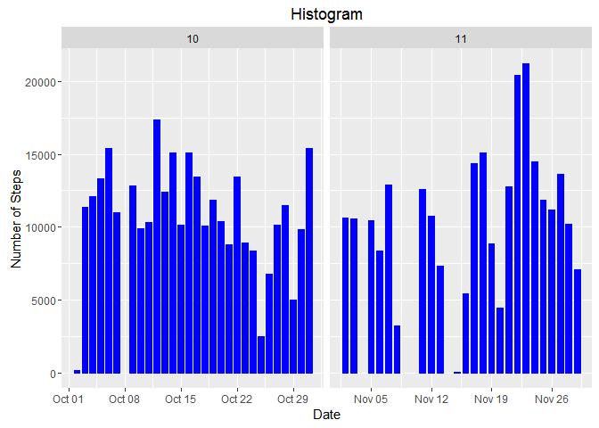
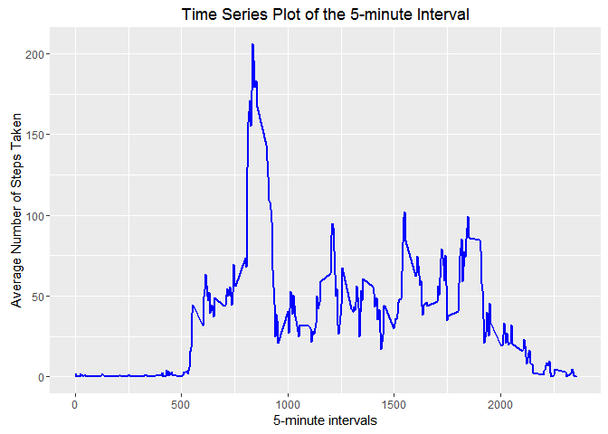
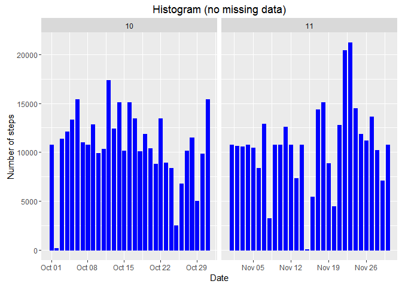

# reproducible research project1
Andrew Weston  
April 17, 2016  

---
title: "Reproducible Research Project 1"
author: "Andrew Weston"
date: "April 17, 2016"
output: html_document
---


##Loading and processing the data
First we load the information into a data frame, fixing the data types as necessary and removing NA values.

```r
echo = TRUE  # Always make code visible
activity <- read.csv("activity.csv", colClasses = c("integer", "Date", "factor"))
activity <- na.omit(activity)
#we add a column for "month" by getting it from the "Date"
activity$month <- as.numeric(format(activity$date, "%m"))
#change first column of our data to be 1, 2, 3, ... instead of 289, 290, 291, ...
rownames(activity) <- 1:nrow(activity)
#we'll need ggplot2 later
library(ggplot2)
```
##Mean total number of steps per day

```r
ggplot(activity, aes(date, steps)) + 
  geom_bar(stat = "identity", colour = "blue", fill = "blue", width = 0.7) + 
  facet_grid(. ~ month, scales = "free") + 
  labs(title = "Histogram", x = "Date", y = "Number of Steps")
```



And to calculate the mean/median number of steps per day:


```r
#first we add up all the steps for each day
totalSteps <- aggregate(activity$steps, list(Date = activity$date), FUN = "sum")$x

mean(totalSteps)
```

```
## [1] 10766.19
```

```r
median(totalSteps)
```

```
## [1] 10765
```
##Daily activity pattern
We create a Time Series Plot of the 5-minute intervals.

```r
avgSteps <- aggregate(activity$steps, list(interval = as.numeric(as.character(activity$interval))), FUN = "mean")
names(avgSteps)[2] <- "meanOfSteps"

ggplot(avgSteps, aes(interval, meanOfSteps)) + 
  geom_line(color = "blue", size = 0.8) + 
  labs(title = "Time Series Plot of the 5-minute Interval", x = "5-minute intervals", y = "Average Number of Steps Taken")
```



The max value is apparent from the plot, but to find the exact 5-minute interval with the most steps we use the following:

```r
avgSteps[avgSteps$meanOfSteps == max(avgSteps$meanOfSteps), ]
```

```
##     interval meanOfSteps
## 104      835    206.1698
```
##Adding missing values
We removed all the NA values earlier, so we need to read the file again to count them.

```r
activity2 <- read.csv("activity.csv", colClasses = c("integer", "Date", "factor"))
activity2$month <- as.numeric(format(activity2$date, "%m"))
sum(is.na(activity2))
```

```
## [1] 2304
```
We would like to replace the missing values with something reasonable. We will use the average number of steps for the same 5-minute intervals on other days (i.e. days that aren't missing values).

```r
for (i in 1:nrow(activity2)) {
  if (is.na(activity2$steps[i])) {
    activity2$steps[i] <- avgSteps[which(activity2$interval[i] == avgSteps$interval), ]$meanOfSteps
  }
}
sum(is.na(activity2))
```

```
## [1] 0
```
And then we plot the data with the added values.

```r
ggplot(activity2, aes(date, steps)) + 
	geom_bar(stat = "identity", colour = "blue", fill = "blue", width = 0.7) + 
	facet_grid(. ~ month, scales = "free") + 
	labs(title = "Histogram (no missing data)", x = "Date", y = "Number of steps")
```



We would like to compare the mean and median number of steps to our old totals.

```r
newTotalSteps <- aggregate(activity2$steps, 
                           list(Date = activity2$date), 
                           FUN = "sum")$x
paste("New mean:", mean(newTotalSteps), "Old mean:", mean(totalSteps))
```

```
## [1] "New mean: 10766.1886792453 Old mean: 10766.1886792453"
```

```r
paste("New median:", median(newTotalSteps), "Old median:", median(totalSteps))
```

```
## [1] "New median: 10766.1886792453 Old median: 10765"
```
The mean didn't change (which makes sense since we replaced missing values with average values for subintervals). But the median increased.

##Weekdays vs. weekends
We add a field to our data frame to store the day of the week, then a factor variable for "weekday" vs. "weekend."

```r
activity2$day_of_week <- c("Sunday", "Monday", "Tuesday", "Wednesday", "Thursday", 
                       "Friday", "Saturday")[as.POSIXlt(activity2$date)$wday + 1]
activity2$weekend <- activity2$day_of_week %in% c("Saturday", "Sunday")
```
Now we have a field, activity2$weekend which is simply TRUE if the day Saturday or Sunday, and FALSE if the day is Monday through Friday.

```r
activity2[1440,]
```

```
##      steps       date interval month day_of_week weekend
## 1440     0 2012-10-05     2355    10      Friday   FALSE
```

```r
activity2[1450,]
```

```
##      steps       date interval month day_of_week weekend
## 1450     0 2012-10-06       45    10    Saturday    TRUE
```
Now we aggregate the step data by weekend day, and week day, and compare.

```r
avgSteps <- aggregate(activity2$steps, 
                      list(interval = as.numeric(as.character(activity2$interval)), 
                           weekdays = ifelse(activity2$weekend, "Weekend", "Weekday")),
                      FUN = "mean")
names(avgSteps)[3] <- "meanOfSteps"
library(lattice)
xyplot(avgSteps$meanOfSteps ~ avgSteps$interval | avgSteps$weekdays, 
       layout = c(1, 2), type = "l", 
       xlab = "Interval", ylab = "Number of steps")
```


